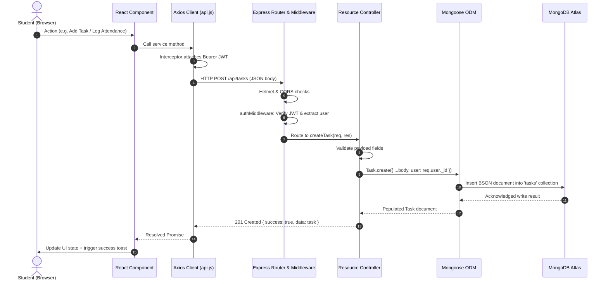

# System Architecture — SAP-SMS (MERN Stack)

## 1. High-Level Architectural Overview

**SAP-SMS (Student Academic Planner and Student Management System)** is constructed as a modern, decoupled Single-Page Application (SPA) backed by a RESTful API and cloud document database.

```
┌─────────────────────────────────────────────────────────────┐
│                      Client Tier                            │
│   React 18 + Vite + Tailwind CSS + Lucide Icons (PWA Shell) │
└──────────────────────────────┬──────────────────────────────┘
                               │
                       HTTPS / JSON (Axios)
                               │
┌──────────────────────────────▼──────────────────────────────┐
│                    API Gateway / App Server                 │
│      Node.js + Express.js (REST API, Helmet, CORS)          │
└──────────────────────────────┬──────────────────────────────┘
                               │
                      ODM Mapping (Mongoose 8)
                               │
┌──────────────────────────────▼──────────────────────────────┐
│                      Database Tier                          │
│               MongoDB Atlas (Cloud Cluster)                 │
└─────────────────────────────────────────────────────────────┘
```

---

## 2. Tier Breakdown

### A. Client Tier (Frontend)
- **Framework & Tooling**: Built with **React 18** and **Vite** for rapid hot-module reloading and optimized production bundles.
- **Styling**: **Tailwind CSS** with a dual light/dark theme architecture persisted in local storage.
- **Client Routing**: **React Router v6** configured with declarative route guards:
  - `PublicRoute`: Redirects already authenticated sessions to `/dashboard`.
  - `ProtectedRoute`: Blocks unauthenticated visitors and verifies JWT validity before mounting private layouts.
- **Data Fetching Layer**: Centralized **Axios** instance located at `frontend/src/services/api.js`.
  - Interceptors automatically inject the `Authorization: Bearer <token>` header from `localStorage`.
  - Intercepts `401 Unauthorized` responses to expire local tokens and route to `/login?session=expired`.
- **Progressive Web App (PWA)**:
  - `manifest.webmanifest`: Dictates standalone display mode, orientation, branding colors, and icon specifications.
  - `sw.js` (Service Worker): Caches static assets for offline shells and handles push notification click-throughs.

### B. Application Server Tier (Backend)
- **Runtime**: **Node.js** (LTS v18+).
- **Web Framework**: **Express.js** structured under a strict controller-service-repository pattern:
  - `src/controllers/`: Express route handlers responsible for extracting request parameters, invoking services, and sending standardized JSON envelopes.
  - `src/middleware/`: Reusable request interception (`authMiddleware`, `errorMiddleware`, `validateMiddleware`).
  - `src/services/`: Pure business logic decoupled from HTTP frameworks (e.g. `attendanceService` math and `notificationService`).
  - `src/models/`: Mongoose schemas defining validation, indices, and virtual attributes.
- **Security Protocols**:
  - `helmet`: Applies secure HTTP response headers (XSS filtering, frameguard, CSP-readiness).
  - `cors`: Restricts cross-origin requests to configured trusted frontend origins (`process.env.CLIENT_URL`).
  - `bcryptjs`: One-way salted hashing (cost factor 10) for stored passwords.
  - `jsonwebtoken`: Stateless, time-limited JWT tokens for authorization.

### C. Database Tier (MongoDB Atlas)
- **Engine**: MongoDB Atlas multi-tenant or dedicated cloud cluster.
- **ODM**: **Mongoose 8.x**.
- **Model Relationships & Data Isolation**:
  - Every academic document (`Subject`, `Task`, `Event`, `Attendance`, `Timetable`, `NotificationPreference`) maintains a required reference (`user: ObjectId`) to its parent `User`.
  - The API strictly scopes all database reads, updates, and deletes to `req.user._id`, ensuring zero cross-tenant data leaks.

---

## 3. Core Data Flow Diagram



---

## 4. Authentication & Authorization Lifecycle

1. **Registration / Login**:
   - Client sends credentials (`email`, `password`) over HTTPS to `/api/auth/register` or `/api/auth/login`.
   - Backend compares candidate password with `bcrypt.compare()`.
   - On success, backend issues a signed JWT (`jwt.sign({ id: user._id }, JWT_SECRET, { expiresIn: '7d' })`).
2. **Client Token Storage**:
   - React application stores the token in `localStorage` alongside essential profile claims.
3. **Protected API Access**:
   - On every subsequent request, Axios attaches `Authorization: Bearer <token>`.
   - `authMiddleware` intercepts the request, verifies the signature using `process.env.JWT_SECRET`, retrieves the user record from MongoDB, and mounts it on `req.user`.
4. **Session Expiry**:
   - If the token expires, the backend responds with `401 Unauthorized`.
   - The Axios response interceptor purges `localStorage` and routes the student back to `/login`.

---

## 5. Web Push Notification Architecture

```
┌─────────────────────┐             ┌─────────────────────┐
│  Browser PWA Client │             │  SAP-SMS Backend    │
│  (PushManager)      │             │  (web-push service) │
└──────────┬──────────┘             └──────────┬──────────┘
           │                                   │
           │ 1. Request VAPID Public Key       │
           ├──────────────────────────────────>│
           │ 2. Return Public Key              │
           │<──────────────────────────────────┤
           │                                   │
           │ 3. pushManager.subscribe()        │
           │ (via Push Service: FCM/Mozilla)   │
           │                                   │
           │ 4. POST /api/notifications/sub    │
           ├──────────────────────────────────>│
           │                                   │ 5. Save subscription to
           │                                   │    NotificationPreference
           │                                   │
           │                                   │ 6. When reminder triggers:
           │                                   │    webpush.sendNotification()
           │                                   │    to endpoint with payload
           │ 7. 'push' event fires in sw.js    │
           │<──────────────────────────────────┤
           │ 8. sw.js shows system notice      │
```

---

## 6. Deployment Topology

- **Frontend**: Static production build deployed to **Vercel** or **Netlify** with single-page routing rewrite rules (`/*` -> `/index.html`).
- **Backend**: Containerized or native Node service hosted on **Railway**, **Render**, or **Fly.io**.
- **Database**: Cloud-hosted **MongoDB Atlas** with IP access list and TLS 1.3 encryption in transit.
